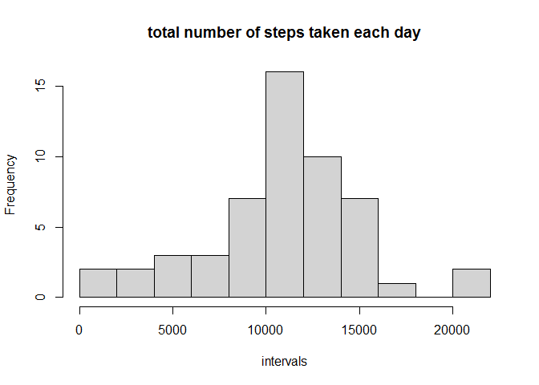
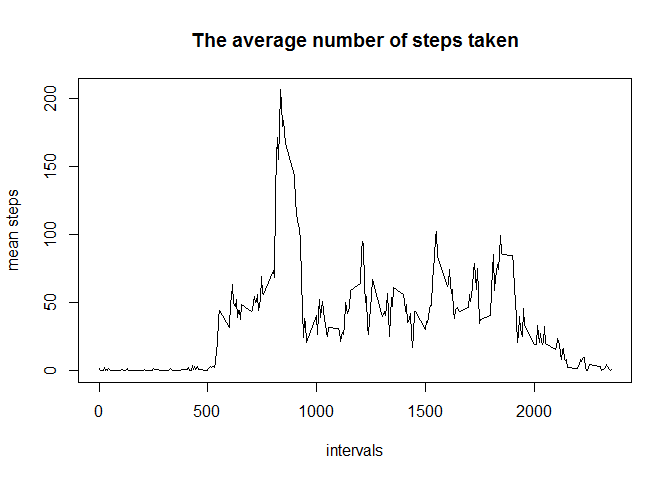
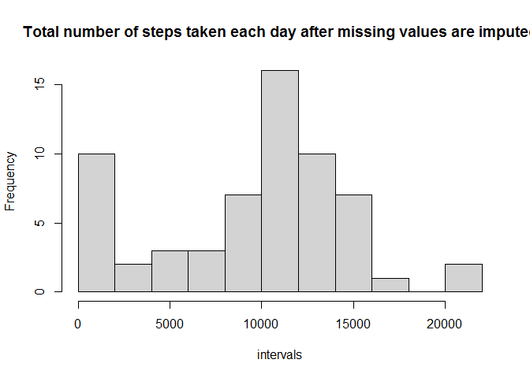
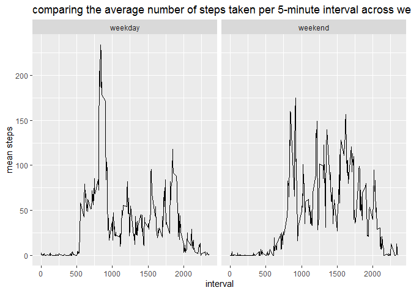

## Loading and preprocessing the data

```r
df <- read.csv(unz("activity.zip", "activity.csv"))
df_na <- df[is.na(df$steps),]       # dataframe with only NA values
df_wo_na <- df[!is.na(df$steps),]   # dataframe without NA values
```

## What is mean total number of steps taken per day?

```r
library(dplyr)
sum_steps_by_date <- df_wo_na %>% group_by(date) %>% summarize(sum_steps = sum(steps))
hist(sum_steps_by_date$sum_steps, breaks=10, main="total number of steps taken each day", xlab="intervals")
```

<!-- -->

```r
mean_steps_per_day <- mean(sum_steps_by_date$sum_steps)
median_steps_per_day <- median(sum_steps_by_date$sum_steps)
print(paste0("Mean of steps taken each day: ", mean_steps_per_day))
```

```
## [1] "Mean of steps taken each day: 10766.1886792453"
```

```r
print(paste0("Median of steps taken each day: ", median_steps_per_day))
```

```
## [1] "Median of steps taken each day: 10765"
```

## What is the average daily activity pattern?

```r
mean_steps_by_interval <- df_wo_na %>% group_by(interval) %>% summarize(mean_steps = mean(steps))
plot(mean_steps_by_interval$interval, mean_steps_by_interval$mean_steps, type="l", main="The average number of steps taken", xlab="intervals", ylab="mean steps")
```

<!-- -->

```r
max_index <- which.max(mean_steps_by_interval$mean_steps)
print(paste0("The 5-minute interval that, on average, contains the maximum number of steps: ",mean_steps_by_interval$interval[max_index]))
```

```
## [1] "The 5-minute interval that, on average, contains the maximum number of steps: 835"
```

## Imputing missing values

```r
print(paste0("total number of missing values in the dataset : ",dim(df_na)[1]))
```

```
## [1] "total number of missing values in the dataset : 2304"
```

```r
# Code to describe and show a strategy for imputing missing data
mean_steps_by_date <- df_wo_na %>% group_by(date) %>% summarize(mean_steps = mean(steps))
df_new <- df
for(i in 1:length(df_new$steps))
{
    steps_cur <- df_new[i,1]
    date_cur <- df_new[i,2]

    if(is.na(steps_cur))
    {
        ind_date <- which(date_cur==mean_steps_by_date)
        if(length(ind_date))
        {
            df_new[i,1] <- mean_steps_by_date[ind_date,]$mean_steps
        }
        else
        {
            df_new[i,1] <- 0
        }
    }
}

sum_steps_by_date_new <- df_new %>% group_by(date) %>% summarize(sum_steps = sum(steps))
hist(sum_steps_by_date_new$sum_steps, breaks=10, main="Total number of steps taken each day after missing values are imputed", xlab="intervals")
```

<!-- -->

```r
mean_steps_per_day_new <- mean(sum_steps_by_date_new$sum_steps)
median_steps_per_day_new <- median(sum_steps_by_date_new$sum_steps)
print(paste0("Mean of steps taken each day after filling NA-s: ", mean_steps_per_day_new))
```

```
## [1] "Mean of steps taken each day after filling NA-s: 9354.22950819672"
```

```r
print(paste0("Median of steps taken each day after filling NA-s: ", median_steps_per_day_new))
```

```
## [1] "Median of steps taken each day after filling NA-s: 10395"
```

## Are there differences in activity patterns between weekdays and weekends?

```r
weekend_days = c("Szo", "V")
df_with_isWeekend <- mutate(
    df_wo_na, isWeekend = factor(case_when(
        weekdays(as.Date(date,"%Y-%m-%d"), abbreviate=TRUE) %in% weekend_days ~ "weekend",
        !(weekdays(as.Date(date,"%Y-%m-%d"), abbreviate=TRUE) %in% weekend_days) ~ "weekday")))

mean_steps_by_interval_with_isWeekend <- df_with_isWeekend %>% group_by(interval, isWeekend) %>% summarize(mean_steps = mean(steps))

library(ggplot2)
p <- ggplot(data=mean_steps_by_interval_with_isWeekend, aes(x=interval, y=mean_steps)) + labs(title= "") + facet_grid(.~isWeekend) + geom_line() + ggtitle("comparing the average number of steps taken per 5-minute interval across weekdays and weekends") + ylab("mean steps")
print(p)
```

<!-- -->
